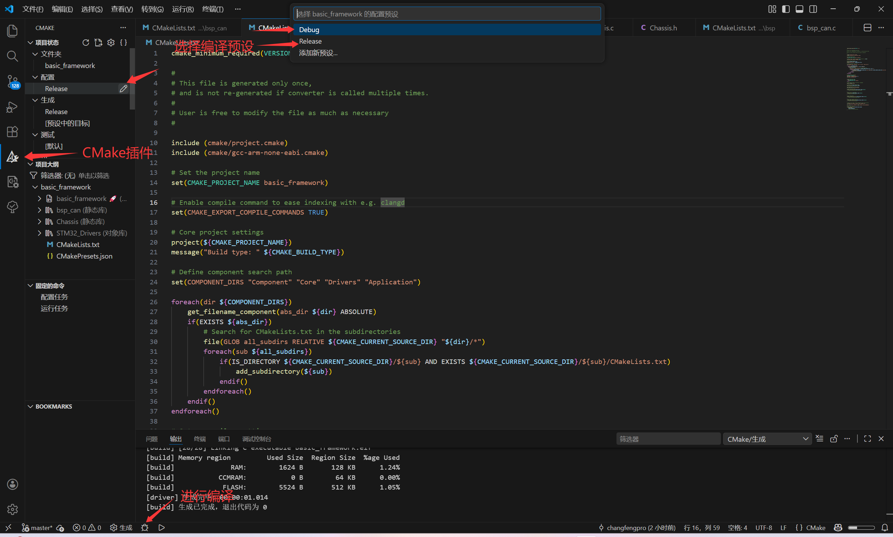

# STM32 模块化开发框架 (基于 CMake & Ninja)

本项目是一个专为 STM32 设计的模块化开发框架，其核心思想借鉴了 **ESP-IDF** 的组件化管理方式。通过 CMake 脚本实现组件的自动化注册、依赖分发及跨平台构建。

## 1. 核心设计思想：组件化 (Component-Based)

本项目不仅仅是将代码分目录存放，而是将每个功能单元视为一个独立的“组件”。

* **物理隔离**：每个组件（如 `bsp_can` 或 `Chassis`）都拥有独立的文件夹和 `CMakeLists.txt`。
* **依赖透明**：组件之间的引用必须通过 `REQUIRES` 显式声明。
* **自动路径分发**：当你声明一个依赖时，构建系统会自动将该依赖的头文件路径（Include Paths）加入编译命令，开发者无需手动在根目录添加路径。

---

## 2. 目录架构说明

```text
.
├── Application/        # 高级应用逻辑层 (Chassis, Task, etc.)
├── Component/          # 底层硬件抽象/驱动层 (bsp_can, bsp_uart, etc.)
├── Core/               # MCU 启动逻辑及入口 (main.c, stm32f4xx_it.c)
├── Drivers/            # 官方 HAL 库及 CMSIS
├── cmake/              # 构建系统核心
│   ├── project.cmake   # 组件注册宏定义 (register_component)
│   └── gcc-arm-none-eabi.cmake  # 交叉编译器设置及优化参数
├── CMakeLists.txt      # 全局入口，负责组件自动扫描
└── CMakePresets.json   # 编译环境预设 (Debug/Release)

```

---

## 3. CMake 构建系统详解

### 3.1 自动化扫描机制

根目录 `CMakeLists.txt` 不再手动列出源文件，而是通过以下逻辑遍历目录：

1. 定义 `COMPONENT_DIRS`（如 `Application`, `Component` 等）。
2. 循环遍历这些文件夹及其一级子目录。
3. 如果子目录下存在 `CMakeLists.txt`，则通过 `add_subdirectory` 进入该组件。

### 3.2 组件注册宏 (`register_component`)

每个组件内部通过该宏进行“自我描述”，这是打通路径的关键：

```cmake
# 示例：Application/Chassis/CMakeLists.txt
register_component(
    SRCS 
        "Chassis.c"
    INCLUDE_DIRS 
        "."               # 导出当前路径作为公共头文件目录
    REQUIRES 
        "stm32cubemx"     # 依赖底层硬件库
        "bsp_can"         # 依赖特定的 BSP 组件
)

```

---

## 4. 优化等级与构建预设 (Presets)

通过 `CMakePresets.json`，你可以快速在不同模式间切换。本项目对 Release 模式进行了针对性优化：

| 预设模式 | 优化等级 | 特点 | 适用场景 |
| --- | --- | --- | --- |
| **Debug** | `-O0` | 不优化，保留完整调试信息 (`-g3`) | 逻辑调试、打断点、单步执行 |
| **Release** | **`-Os`** | **体积优化**，删除调试信息 (`-g0`) | 最终固件发布，节省 Flash 空间 |

### ⚠️ 重要：关于 `volatile`

在 **Release (`-Os`)** 模式下，编译器会进行指令重排或缓存变量。

* 所有在中断中修改的全局变量、或者指向硬件寄存器的指针（如轮询状态位），**必须使用 `volatile` 关键字**，否则编译器可能会将其优化为死循环。

---

## 5. 快速上手手册

### 5.1 增加一个新组件 (以 `bsp_spi` 为例)

1. 在 `Component/bsp/` 下创建文件夹 `bsp_spi`。
2. 创建 `bsp_spi.c` 和 `bsp_spi.h`。
3. 创建 `CMakeLists.txt` 并调用 `register_component`。
4. 由于目录嵌套，确保父目录 `Component/bsp/CMakeLists.txt` 中包含 `add_subdirectory(bsp_spi)`或者采用**下文 6. 注意事项** 中的多级目录自动化方式。

* `register_component`通用模板:
```
file(GLOB SOURCES "*.c" "*.cpp")
register_component(
    SRCS 
        ${SOURCES}
    INCLUDE_DIRS 
        "."                 # "."代表当前文件夹包含头文件
    REQUIRES 
        "stm32cubemx" # 依赖 HAL 库定义
        
)

```

### 5.2 常用编译命令

```bash
# 传统编译方式

#Debug
cmake -B build/Debug -G Ninja -DCMAKE_BUILD_TYPE=Debug
ninja -C build/Debug

#Release
cmake -B build/Release -G Ninja -DCMAKE_BUILD_TYPE=Release
ninja -C build/Release

##################################################################

# CMake Presets方式

# Debug

# 1. 配置 Debug 预设
cmake --preset Debug

# 2. 编译 (Ninja 会自动寻找 build/Debug 目录)
cmake --build --preset Debug

# Release
cmake --preset Release
cmake --build --preset Release

```
* 或者使用**vscode**中**CMake插件**以按键的方式编译
  


---

## 6. C/C++ 混合编程规范

由于底层 HAL 库是纯 C 编写，混合编程需遵循以下原则：

* **Extern "C" 保护**：所有被 `.cpp` 引用的 C 头文件必须包含 `extern "C"` 块。
```c
#ifdef __cplusplus
extern "C" {
#endif
/* 声明 */
#ifdef __cplusplus
}
#endif

```

* 例如`djimotor.h`
```bsp_can.h
#ifndef __DJIMOTOR_H
#define __DJIMOTOR_H
#include "stdint.h"
#include "bsp_can.h"

/* C++ USER CODE BEGIN  */
#ifdef __cplusplus

// 电机控制模式
enum DJI_Motor_Control_Method {
    MOTOR_STOP = 0,
    MOTOR_SPEED,
    MOTOR_ANGLE
};

class DJIMotor {
public:
    // 构造函数
    void DJIMotor_Init(CAN_HandleTypeDef* hcan, uint32_t can_id);

    // 应用层接口：设置目标
    void Set_Target_Speed(float speed);
    
    // 驱动层接口：更新反馈 (由 BSP 接收中断调用)
    void Update_Feedback(uint8_t data[8]);

    // 数据获取接口 (供发送函数使用)
    int16_t Get_Output_Current() const;
    CAN_HandleTypeDef* Get_Hcan() const;
    uint32_t Get_ID() const;

private:
    CAN_HandleTypeDef* _hcan;
    uint32_t           _can_id;
    
    DJI_Motor_Control_Method _mode;

    // 反馈数据
    uint16_t _now_angle_raw;
    int16_t  _now_speed_raw;
    int16_t  _target_current; // 最终计算出的电流值

    float    _target_speed;
    // 这里未来可以添加 PID 成员对象：PID _speed_pid;
};

/* C++ USER CODE END   */
#endif // __cplusplu


#ifdef __cplusplus
extern "C" {
#endif

#ifdef __cplusplus
}
#endif
#endif /* __DJIMOTOR_H */

```

* **中断回调**：若在 `.cpp` 中编写中断回调函数（如 `HAL_CAN_RxFifo0MsgPendingCallback`），必须放在 `extern "C"` 块内，防止名称粉碎导致链接失败。
* **静态构造**：框架已处理 `__libc_init_array`，支持全局对象的构造函数调用。
* **内存管理**：嵌入式环境建议优先使用静态分配，谨慎使用 `new/delete`。

---

## 7. 开发注意事项

* **依赖声明**：本框架采用静态库链接模式。在代码中 `#include` 某个头文件后，**必须**在该组件的 `CMakeLists.txt` 中的 `REQUIRES` 下显式声明，只有声明了 `REQUIRES`，CMake 才会将目标组件的 `INCLUDE_DIRS` 注入到当前组件的编译选项中。

* **新增多级目录自动化**：由于框架支持如 `Component/bsp/bsp_can` 这样的多级嵌套，为了避免手动在每一层写 `add_subdirectory`，建议采用以下自动化方案：
  * **中间层引导**：在 `Component/bsp` 等非组件的中间文件夹下，放置一个包含自动扫描逻辑的 `CMakeLists.txt`。
  * **通用扫描脚本**：（例如Component/bsp/CMakeLists.txt）
```cmake
# 自动遍历当前目录下所有包含 CMakeLists.txt 的子目录
file(GLOB children RELATIVE ${CMAKE_CURRENT_SOURCE_DIR} *)
foreach(child ${children})
    if(IS_DIRECTORY ${CMAKE_CURRENT_SOURCE_DIR}/${child} AND EXISTS ${CMAKE_CURRENT_SOURCE_DIR}/${child}/CMakeLists.txt)
        add_subdirectory(${child})
    endif()
endforeach()
```

---

## 8. 常见问题排查 (Q&A)

* **Q: 提示 `unknown type name 'HAL_StatusTypeDef'`?**
* A: 检查组件是否 `REQUIRES` 了 `stm32cubemx`，且头文件中是否先包含了 `stm32f4xx_hal.h`。


* **Q: 出现 `conflicting types for 'xxx'` 错误?**
* A: 通常是因为函数调用写在了函数体外部，或者 C/C++ 混合调用时缺少 `extern "C"`。


* **Q: 编译报错 `Undefined reference to 'xxx'`?**
* A: 检查该函数所在的组件是否已在当前组件的 `REQUIRES` 中声明。


* **Q: Release 模式下程序跑飞/卡死?**
* A: 检查中断标志位或硬件寄存器相关的变量是否遗漏了 `volatile` 声明。


---

## 9. 典型问题与解决方案 

### 9.1 Ninja 构建系统的依赖问题

* **现象**：重命名文件（如 `Chassis.c` 改为 `Chassis.cpp`）并修改 `CMakeLists.txt` 后，编译报错：`ninja: error: '...Chassis.c', needed by '...', missing and no known rule to make it`。
* **原因**：Ninja 会缓存上一次编译的依赖树。当你删除/重命名文件时，旧的构建规则仍然残留在 `build` 文件夹的缓存中。
* **解决**：**必须彻底删除 `build` 文件夹**并重新进行 CMake Configure。仅仅点击“Clean”可能无法清除 Ninja 的目标缓存。

### 9.2 HAL 库类型识别失败 (`HAL_StatusTypeDef`)

* **现象**：报错 `unknown type name 'HAL_StatusTypeDef'` 或大量 HAL 库内部函数报错。
* **原因**：
1. **错误的包含方式**：直接包含了外设头文件（如 `#include "stm32f4xx_hal_can.h"`）。
2. **包含顺序错乱**：在定义 HAL 类型之前引用了它们。


* **规范建议**：
* **永远不要**直接包含 `stm32f4xx_hal_xxx.h`。
* **始终包含**总头文件 `#include "stm32f4xx_hal.h"`，它会处理所有的宏定义依赖、类型声明以及 `stm32f4xx_hal_conf.h` 的加载。


### 9.3 C++ 调用 C 导致的链接/声明错误

* **现象**：`error: 'hcan1' was not declared in this scope`。
* **原因**：CubeMX 生成的变量（如 `hcan1`）是在 `.c` 文件中定义的。在 `.cpp` 文件中引用时，编译器默认按照 C++ 的名称修饰规则寻找，导致匹配失败。
* **规范建议**：
* 在 C++ 中引用 C 全局变量时，必须使用 `extern "C"`：
```cpp
extern "C" {
    extern CAN_HandleTypeDef hcan1;
}

```
* 或者更推荐的做法是：在 `main.c` 初始化时将句柄指针传递给组件，实现解耦。

---

**HNUYueLuRM框架待移植**
